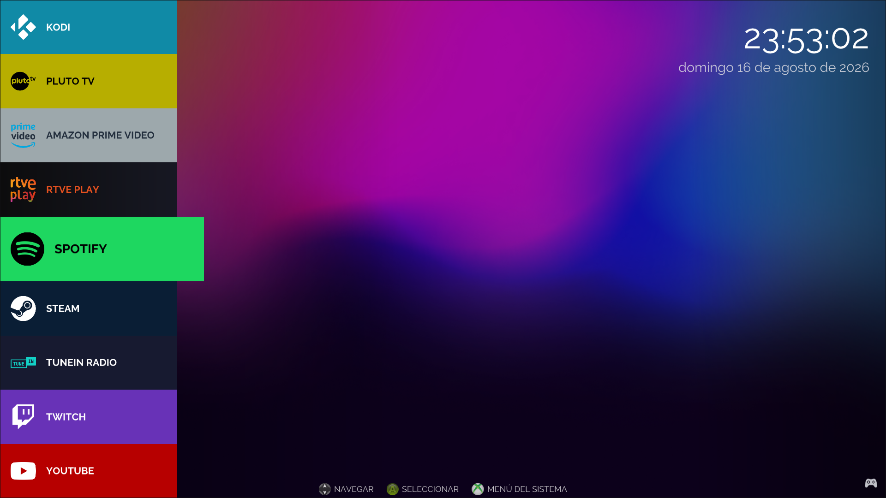

# Ludex Launcher

A lightweight 10-foot launcher for Linux gaming and HTPC/media centers, designed for TV screens and remote/game controllers.

[](https://www.gnu.org/licenses/old-licenses/gpl-2.0.en.html)
[](#)
[](#)



## Features

### User Interface
- **Controller-first navigation**: Optimized for D-pad/analog stick with hold-to-repeat
- **Multiple layouts**: Vertical (left/right) or horizontal (top/bottom) drawer positioning
- **Dynamic wallpapers**: Ken Burns effect with smooth crossfade transitions
- **Dark/light themes**.
- **Internationalization support**.
- **Touch/mouse support**: Drag gestures with momentum physics

### System Integration
- **Multi-controller support**: Up to 8 players with individual GUID-based assignment
- **Bluetooth management**: Uses `bluetoothctl` as backend.
- **Audio system**: Background music with shuffle + UI sound effects
- **Backend system**: Flexible app launching via configurable command templates
- **IR remote support**: LIRC integration (compile-time option)

### Performance
- **Lazy loading**: Icons and wallpapers loaded on-demand with LRU cache
- **Efficient rendering**: SDL2 + ImGui with GPU-accelerated 2D renderer
- **Optimized data structures**: O(1) lookups for controllers and backends
- **Minimal VRAM usage**: O(2) wallpaper memory (current + next for crossfade)

## Building from Source

### Prerequisites

#### Debian/Ubuntu

```bash
sudo apt update
sudo apt install \
    build-essential \
    cmake \
    ninja-build \
    libsdl2-dev \
    libsdl2-image-dev \
    libsdl2-mixer-dev \
    librsvg2-dev \
    libcairo2-dev \
    gettext
```

#### Fedora

```bash
sudo dnf install \
    gcc-c++ \
    cmake \
    ninja-build \
    SDL2-devel \
    SDL2_image-devel \
    SDL2_mixer-devel \
    librsvg2-devel \
    cairo-devel \
    gettext
```

#### Arch Linux

```bash
sudo pacman -S \
    base-devel \
    cmake \
    ninja \
    sdl2 \
    sdl2_image \
    sdl2_mixer \
    librsvg \
    cairo \
    gettext
```

### Compilation

```bash
git clone https://github.com/manu-romero-411/ludex-launcher.git
cd ludex-launcher

# Configure and build
cmake -B build -G Ninja -DCMAKE_BUILD_TYPE=Release
cmake --build build

# Run
./build/ludex-launcher
```

### Installation

```bash
# Install to /opt/ludex (requires sudo)
sudo cmake --install build --prefix /opt/ludex

# Or install to user directory
cmake --install build --prefix ~/.local
```

## Configuration

Configuration is stored in `~/.config/ludex/ludex-launcher.ini` and created automatically on first run.

### UI Settings

```ini
[ludex-launcher]
# Layout
side=left                    # left, right, top, bottom
visible_items=7              # Number of visible tiles (must be odd, 3-11)
theme=dark                   # dark or light
language=es                  # en, es, fr, de, it (empty = system default)

# Visual
wallpaper_dir=~/Pictures/wallpapers
wallpaper_interval=60        # Seconds between wallpaper changes
wallpaper_ken_burns=1        # Enable zoom/pan effect
wallpaper_fade_duration=2.0  # Crossfade duration in seconds

# Audio
music_dir=~/Music            # Background music directory
# Leave empty to use: ./music, ~/.config/ludex/music, or /usr/share/ludex/music
```

### Controller Assignment

Controllers are assigned by GUID (persistent across reboots):

```ini
[controllers]
p1_guid=030000006d04000012c2000011010000
p1_name=Logitech F310
p2_guid=030000005e0400008e02000010010000
p2_name=Xbox 360 Controller
# Leave empty for auto-assignment by connection order
```

## Directory Structure

```
/opt/ludex/
├── ludex-launcher              # Executable
├── locale/                     # Translations (.mo files)
│   └── es/LC_MESSAGES/ludex.mo
├── resources/
│   ├── icons/                  # UI icons (SVG preferred)
│   │   ├── settings.svg
│   │   ├── exit.svg
│   │   ├── bluetooth.svg
│   │   └── help/
│   │       ├── xbox/
│   │       └── playstation/
│   ├── sounds/
│   │   ├── scroll.wav
│   │   └── select.wav
│   └── wallpapers/             # Default wallpapers
├── apps/                       # App definitions (.webapp files)
│   ├── RetroArch.webapp
│   └── Steam.webapp
└── backends/                   # Backend command templates
    ├── retroarch.backend
    ├── webapp.backend
    └── steam.backend
```

### App Definitions

Create `.webapp` files in your apps directory:

```ini
[ludex-element]
name=RetroArch
backend=retroarch
run=                           # Optional: specific ROM or command
icon=retroarch.svg             # Relative to apps/app-icons/ or absolute path
tile_type=gradient2            # flat or gradient2
color1=#333333
color2=#666666
icon_color=#ffffff             # Tint color for monochrome icons
text_color=#ffffff             # Override text color (optional)
```

### Backend Templates

Backends define command templates with placeholders:

```ini
[backend]
name=retroarch
exec_start=retroarch -f %CONTROLLERSCONFIG% %RUN%
exec_end=                      # Optional cleanup command (future)
```

**Available placeholders:**
- `%RUN%` or `%URL%`: The `run` value from the app definition
- `%APP%`: Quoted path to the .webapp file
- `%CONTROLLERSCONFIG%`: Controller configuration string
- `%CONTROLLERSFILE%`: Path to generated controller config file

**Example backends:**

```ini
# Web browser kiosk
[backend]
name=webapp
exec_start=chromium --kiosk --app=%URL%

# Emulator with controller mapping
[backend]
name=retroarch
exec_start=retroarch -f %CONTROLLERSFILE% %RUN%

# Steam Big Picture
[backend]
name=steam
exec_start=steam -tenfoot -silent
```

## Controls

### Gamepad

- **D-pad / Left Stick**: Navigate
- **A / Cross**: Select
- **B / Circle**: Back
- **X / Square**: Alternate action (e.g., unlink Bluetooth device)
- **Start**: Menu
- **Guide / Home**: System menu

### Keyboard

- `↑↓←→` or `WASD`: Navigate
- `Enter` / `Space`: Select
- `Escape`: Back
- `F1` or `Home`: System menu
- `F5`: Reload apps and backends
- `W`: Next wallpaper
- `F6`: Rediscover wallpapers

### Mouse / Touch

- **Click**: Select
- **Drag**: Scroll carousel with momentum
- **Scroll wheel**: Navigate

## Architecture

### Core Components

- **ShellState**: Central state container for UI, apps, and panels
- **PanelSpec/RowDefinition**: Declarative panel system with automatic rendering
- **WallpaperManager**: Lazy loading with O(2) VRAM (current + crossfade)
- **IconCache**: LRU cache for app icons with on-demand loading
- **BluetoothManager**: Async Bluetooth operations with worker thread
- **InputManager**: Multi-controller support with GUID-based assignment

### Performance Optimizations

- **Icon caching**: LRU cache avoids reloading textures (4-frame TTL)
- **Wallpaper lazy loading**: Only 2 wallpapers in VRAM at any time
- **Panel spec caching**: Rebuild only when data changes (token-based invalidation)
- **Unified drag handling**: Single code path for mouse/touch input
- **Efficient lookups**: `unordered_map` for controllers and backends (O(1))

## Internationalization

Ludex uses gettext for translations:

```bash
# Extract translatable strings
xgettext -o locale/ludex.pot --from-code=UTF-8 \
    src/ui/panels/*.cpp \
    src/ui/widgets/*.cpp \
    src/application.cpp

# Create translation (example for Spanish)
msginit -i locale/ludex.pot -o locale/es/LC_MESSAGES/ludex.po -l es

# Edit .po file, then compile
msgfmt -o locale/es/LC_MESSAGES/ludex.mo locale/es/LC_MESSAGES/ludex.po
```

Set `language=es` in the INI file to use Spanish.

## Troubleshooting

### No audio
- Verify SDL2_mixer is installed
- Check music files exist in the configured directory
- Ensure PulseAudio/PipeWire is running
- Try: `SDL_AUDIODRIVER=pulseaudio ./ludex-launcher`

### Controllers not detected
- Install `gamecontrollerdb.txt` or set `SDL_GAMECONTROLLERCONFIG`
- Check controller is in XInput mode (not DirectInput)
- Verify with: `sdl2-jstest --list`
- Check logs: `SDL_HINT_JOYSTICK_ALLOW_BACKGROUND_EVENTS=1`

### Blank screen or crash
- Try X11 fallback: `SDL_VIDEODRIVER=x11 ./ludex-launcher`
- Check GPU drivers are installed
- Run with debug output to see errors

### Apps not appearing
- Verify `.webapp` files are in the apps directory
- Check backend definitions exist in `backends/`
- Ensure backend name matches the `backend=` field in the app
- Run from terminal to see error messages

### Bluetooth issues
- Ensure `bluetoothctl` is installed and working
- Check Bluetooth service is running: `systemctl status bluetooth`
- Verify permissions: user should be in `bluetooth` group

## Dependencies

| Library | Purpose |
|---------|---------|
| SDL2 | Window management, input, events |
| SDL2_image | Image loading (PNG, JPG, WEBP) |
| SDL2_mixer | Audio playback |
| Dear ImGui | Immediate mode GUI framework |
| stb_image | Image decoding (fallback) |
| stb_image_resize2 | High-quality image resizing |
| librsvg | SVG rendering (optional, improves quality) |
| cairo | 2D graphics (required by librsvg) |
| gettext | Internationalization |

## License

Distributed under the GNU GPL v2. See [LICENSE](LICENSE) for details.

## Credits

- **[Dear ImGui](https://github.com/ocornut/imgui)**: Immediate mode GUI
- **[SDL2](https://www.libsdl.org)**: Simple DirectMedia Layer
- **[stb libraries](https://github.com/nothings/stb)**: Single-file public domain libraries
- **[librsvg](https://wiki.gnome.org/Projects/LibRsvg)**: SVG rendering library
